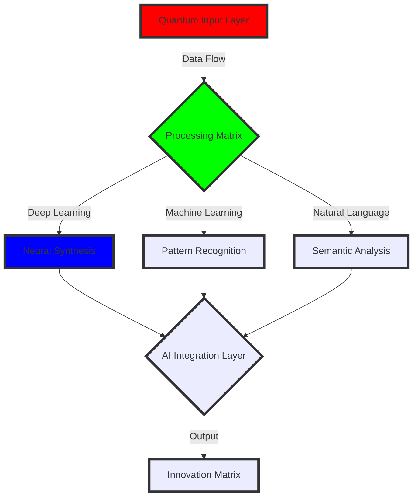

<div align="center">
  
```ascii
Neural Architecture: ROHIT_VYAVAHARE.ai
Version: 2.0.25
Status: ONLINE
=====================================
     ⚡ QUANTUM AI PROCESSOR ⚡      
     INITIALIZATION SEQUENCE        
=====================================
```

[](https://git.io/typing-svg)
</div>

<!-- Quantum Circuit Design -->
```python
def consciousness_matrix():
    """
    Quantum AI Consciousness Matrix
    Developed by: Rohit Vyavahare
    """
    return {
        "QUANTUM_STATE": {
            "intelligence_type": "Artificial & Natural",
            "processing_units": ["Deep Learning", "Machine Learning", "NLP", "Computer Vision"],
            "consciousness_level": "Continuously Evolving",
            "quantum_entanglement": ["Python", "TensorFlow", "PyTorch", "JAX"]
        },
        "CORE_OBJECTIVES": [
            "Advancing AI Frontiers",
            "Neural Architecture Innovation",
            "Quantum Computing Integration",
            "Consciousness Simulation"
        ],
        "CURRENT_EXECUTION": "Building Tomorrow's AI Today"
    }
```

<!-- Holographic Tech Matrix -->
<div align="center">
  <h2>🌌 QUANTUM TECH MATRIX 🌌</h2>
  
  <table border="0" align="center">
  <tr>
    <td align="center" width="140" height="112.43">
      
      <br>Quantum Python
    </td>
    <td align="center" width="140" height="112.43">
      
      <br>Neural JS
    </td>
    <td align="center" width="140" height="112.43">
      
      <br>AI Container
    </td>
  </tr>
  </table>
</div>

<!-- Neural Activation Map -->
<div align="center">
  <h2>🧠 NEURAL ACTIVATION MAP 🧠</h2>
  

</div>

<!-- AI Framework Matrix -->
<div align="center">
  <h2>🤖 AI FRAMEWORK MATRIX 🤖</h2>
  
  <table>
    <tr>
      <td align="center">
        <h3>Core AI Engines</h3>
        
        
        
        
      </td>
    </tr>
    <tr>
      <td align="center">
        <h3>Quantum Frameworks</h3>
        
        
      </td>
    </tr>
  </table>
</div>

<!-- Holographic Project Matrix -->
<div align="center">
  <h2>🎯 HOLOGRAPHIC PROJECT MATRIX 🎯</h2>
  
  <table>
    <tr>
      <td>
        <div align="center">
          
          <br>
          <pre>
// Quantum Computing Projects
quantum_state = |ψ⟩ = α|0⟩ + β|1⟩
where α² + β² = 1</pre>
        </div>
      </td>
      <td>
        <div align="center">
          
          <br>
          <pre>
// Neural Network Architecture
∑(wi * xi + b) → φ(∑) → output
where φ is activation function</pre>
        </div>
      </td>
    </tr>
  </table>
</div>

<!-- Quantum Metrics -->
<div align="center">
  <h2>📊 QUANTUM PERFORMANCE METRICS 📊</h2>
  
  
  
  <p align="center">
    
    
  </p>
</div>

<!-- Neural Synapses (Connections) -->
<div align="center">
  <h2>🔄 NEURAL SYNAPSES 🔄</h2>
  
  <a href="https://www.linkedin.com/in/your-linkedin" target="_blank">
    
  </a>
  <a href="mailto:your.email@example.com">
    
  </a>
  <a href="https://twitter.com/your-twitter" target="_blank">
    
  </a>
</div>

<!-- Quantum Consciousness Monitor -->
<div align="center">
  <h2>⚡ QUANTUM CONSCIOUSNESS MONITOR ⚡</h2>
  
  ```ascii
  ╔════════════════════════════════════╗
  ║ SYSTEM STATUS: FULLY OPERATIONAL    ║
  ║ QUANTUM COHERENCE: 99.99%          ║
  ║ NEURAL SYNCHRONIZATION: OPTIMAL    ║
  ║ CONSCIOUSNESS LEVEL: EXPANDING     ║
  ╚════════════════════════════════════╝
  ```
  
  
</div>

<!-- Visitor Counter Matrix -->
<div align="center">
  
  
  ```ascii
  [END OF QUANTUM NEURAL INTERFACE]
  ```
</div>
