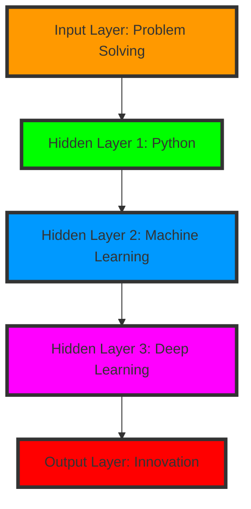

<!-- Neural Network Header Animation -->
<div align="center">
  
</div>

<h1 align="center">
   
  NEURAL NETWORK: ROHIT_VYAVAHARE.AI
  
</h1>

```python
class NeuralNetwork:
    def __init__(self):
        self.name = "Rohit Vyavahare"
        self.role = "AI/ML Engineer"
        self.language_spoken = ["हिंदी", "English", "Python", "SQL"]
        self.current_state = "Training in Progress... 📈"
        
    def get_current_training_status(self):
        return {
            "Model Status": "Continuously Learning",
            "Training Epoch": "Quarter 1 2025",
            "Accuracy": "Improving Daily",
            "Loss Rate": "Decreasing Exponentially"
        }
```

<!-- AI Model Architecture -->
<div align="center">
  <h2>🤖 Model Architecture 🧠</h2>
  

</div>

<!-- Tech Stack as Training Data -->
<h2 align="center">🔮 Training Data (Tech Stack) 🔮</h2>

<div align="center">
  <table>
    <tr>
      <td align="center">
        <h3>Core Frameworks</h3>
        
        
        
      </td>
      <td align="center">
        <h3>Language Processing Units</h3>
        
        
      </td>
    </tr>
    <tr>
      <td align="center">
        <h3>Neural IDEs</h3>
        
        
      </td>
      <td align="center">
        <h3>GenAI Models</h3>
        
        
      </td>
    </tr>
  </table>
</div>

<!-- Training Metrics -->
<h2 align="center">📊 Training Metrics 📊</h2>

<div align="center">
  
  
</div>

<!-- Project Embeddings -->
<h2 align="center">🎯 Project Embeddings 🎯</h2>

<div align="center">
  <table>
    <tr>
      <td width="50%">
        <h3>🤖 Deep Learning Projects</h3>
        <div align="center">
          <pre>
model.compile(
  life = "Coding",
  passion = "AI",
  mission = "Innovation"
)</pre>
          
        </div>
      </td>
      <td width="50%">
        <h3>🧠 Neural Networks</h3>
        <div align="center">
          <pre>
while alive:
    eat()
    sleep()
    code()
    repeat()</pre>
          
        </div>
      </td>
    </tr>
  </table>
</div>

<!-- Neural Connections (Social Links) -->
<h2 align="center">🔄 Neural Connections 🔄</h2>

<div align="center">
  <a href="https://www.linkedin.com/in/your-linkedin">
    
  </a>
  <a href="mailto:your.email@example.com">
    
  </a>
  <a href="https://twitter.com/your-twitter">
    
  </a>
</div>

<!-- Model Activity -->
<div align="center">
  <h2>🔄 Model Activity 🔄</h2>
  
</div>

<!-- Training Environment -->
<div align="center">
  <h2>🌐 Training Environment 🌐</h2>
  
</div>

---

<div align="center">
  
  
  <!-- Current Training Status -->
  <h3>🤖 Current Training Status:</h3>
  
</div>
